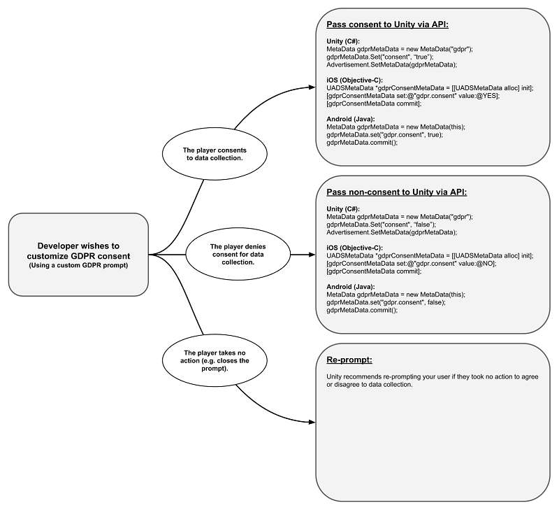

# GDPR compliance

On May 25, 2018, the General Data Protection Regulation ([GDPR](https://en.wikipedia.org/wiki/General_Data_Protection_Regulation)) becomes effective in the European Economic Area (EEA), and all versions of the Unity Ads SDK will be compliant.

## What this means
### Older versions of the SDK
We recommend that you update to the latest version of the SDK, but it is not required for GDPR compliance. After the deadline, legacy versions (below version 2.0) of our SDK will only serve contextual ads to users, strictly based on geographic location and current gameplay. No historical data will be used for ad targeting, including user behavior within the app and across other apps, or installs. 

### Newer versions of the SDK
#### Using Unity's included solution
Versions 2.0 and above will automatically present users with an opportunity to opt-out of targeted advertising, with no implementation needed from the publisher. On a per-app basis, the first time a Unity ad appears, the user will see a banner with the option to opt-out of behaviorally targeted advertising. Thereafter, the user can click an information button to receive the opt-out again. 

#### Using a custom solution
The exception to this is when a publisher or mediator manually requests a user opt-in and sends a flag to Unity (see section on **Manual implementation**, below). In these cases, the Unity opt-out banner will not appear with the ad shown.  Please note that users can still request opt-out or data deletion, and access their data at any time by clicking the information icon in a Unity Ad.

## Manual implementation
If publishers wish to implement a custom solution for user consent, they can pass that information to the Unity Ads SDK before or after initialization using the following code:



#### Unity (C#):
```
MetaData gdprMetaData = new MetaData("gdpr");
gdprMetaData.Set("consent", "true");
Advertisement.SetMetaData(gdprMetaData);
```

#### iOS:
```
UADSMetaData *gdprConsentMetaData = [[UADSMetaData alloc] init];
[gdprConsentMetaData set:@"gdpr.consent" value:@YES];
[gdprConsentMetaData commit];
```

#### Android:
```
MetaData gdprMetaData = new MetaData(this);
gdprMetaData.set("gdpr.consent", true);
gdprMetaData.commit();
```

### Learn more
Please visit our legal site for more information on [Unity's approach to GDPR](https://unity3d.com/legal/gdpr).